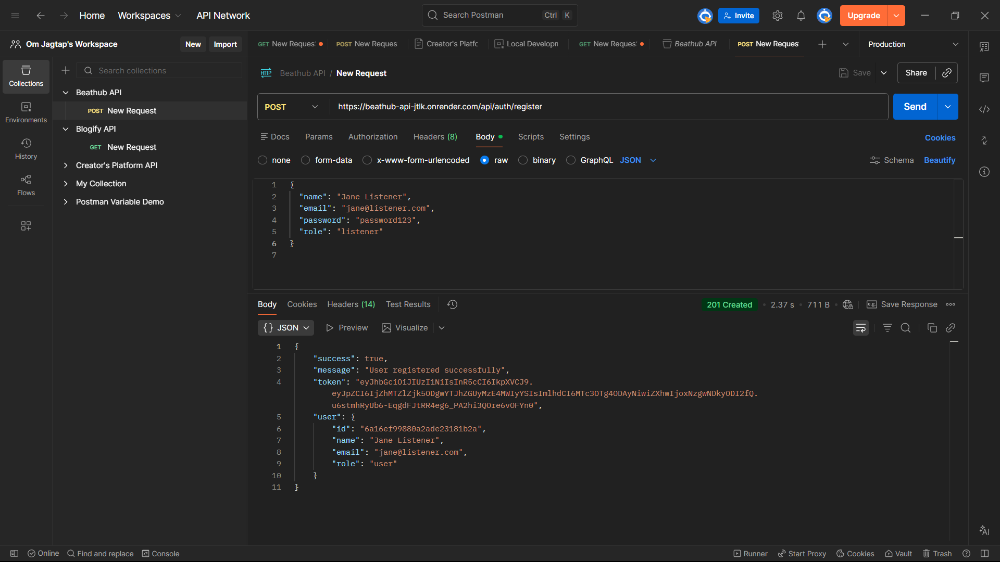
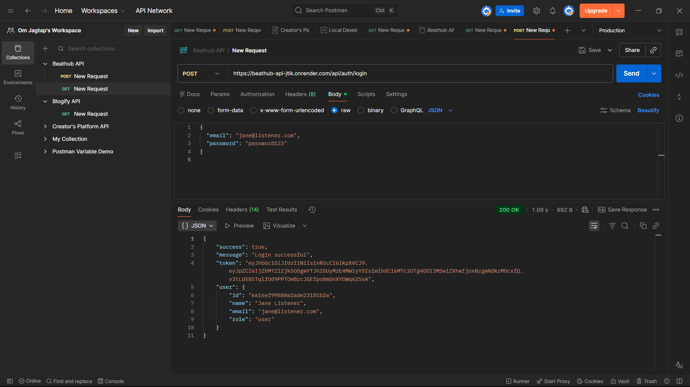
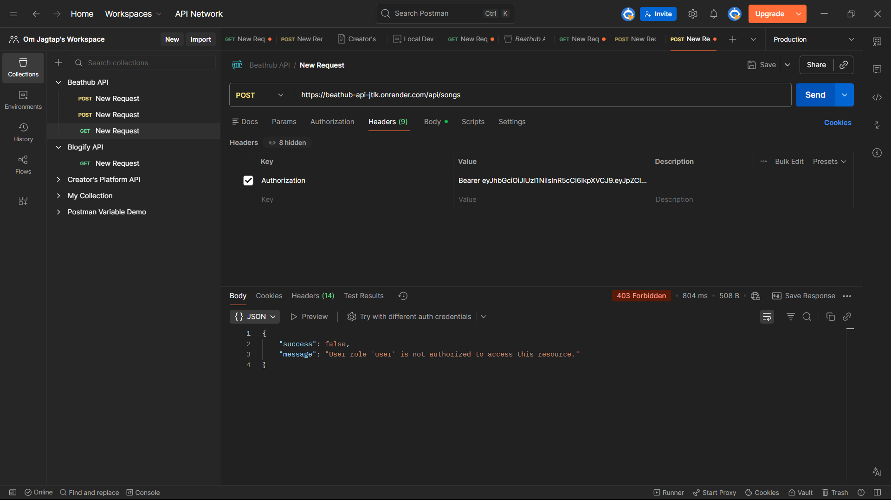

# BeatHub API 🎵

A production-ready REST API for a music streaming platform built with **Node.js, Express, MongoDB, and JWT**.  
Features Role-Based Access Control (RBAC) with Admin, Artist, and Listener roles.

## 🚀 Live Demo
> Base URL: `https://beathub-api-jtlk.onrender.com` 

---

## ✨ Features
- JWT Authentication (Register / Login)
- Role-Based Access Control — Admin / Artist / Listener
- Song management with ownership protection
- bcrypt password hashing
- Centralized error handling middleware
- Input validation with express-validator
- Automated API tests with Jest + Supertest

## 🛠 Tech Stack
| Layer | Technology |
|---|---|
| Runtime | Node.js |
| Framework | Express.js |
| Database | MongoDB + Mongoose |
| Auth | JWT + bcrypt |
| Testing | Jest + Supertest |

## 📁 Project Structure
```
beathub-api/
├── config/         # DB connection
├── controllers/    # Route logic
├── middleware/     # Auth, RBAC, error handler
├── models/         # Mongoose schemas
├── routes/         # Express routers
├── tests/          # Jest test suites
└── server.js
```

## ⚡ Getting Started
```bash
git clone https://github.com/OmJagtap07/beathub-api
cd beathub-api
npm install
cp .env.example .env    # fill in your values
npm run dev
```

## 🔐 API Endpoints

### Auth
| Method | Endpoint | Access | Description |
|---|---|---|---|
| POST | /api/auth/register | Public | Register new user |
| POST | /api/auth/login | Public | Login + receive JWT |

### Songs
| Method | Endpoint | Access | Description |
|---|---|---|---|
| GET | /api/songs | Public | Get all songs |
| POST | /api/songs | Artist / Admin | Upload a song |
| DELETE | /api/songs/:id | Admin only | Delete a song |

## 🔑 RBAC Roles
| Role | Permissions |
|---|---|
| Admin | Full access — manage users and songs |
| Artist | Upload and manage own songs |
| Listener | Read-only access |

## 🧪 Running Tests
```bash
npm test
```

## 📮 API Testing
Import `BeatHub.postman_collection.json` from this repo into Postman to test all endpoints.

---

## 📸 API Screenshots

### Register


### Login


### RBAC in Action — Listener blocked from uploading


### Upload Song — Artist success

